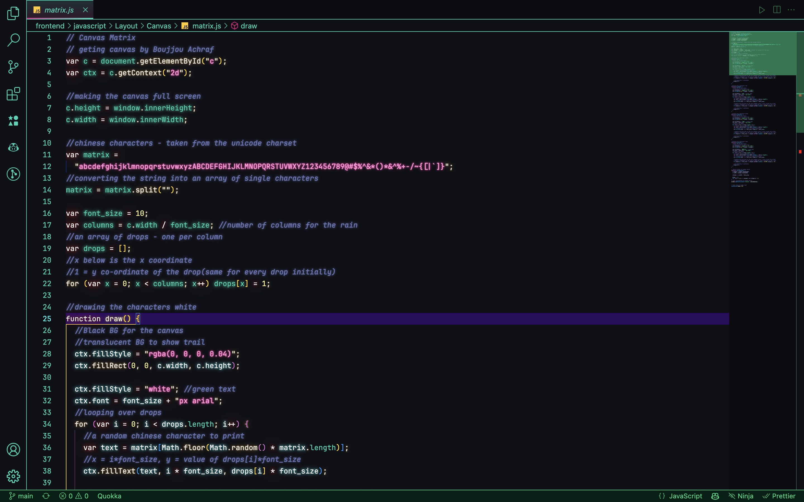
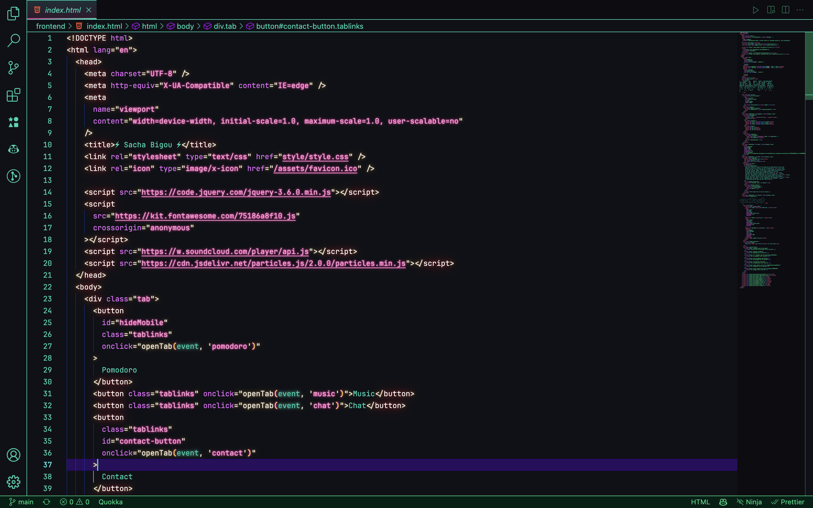
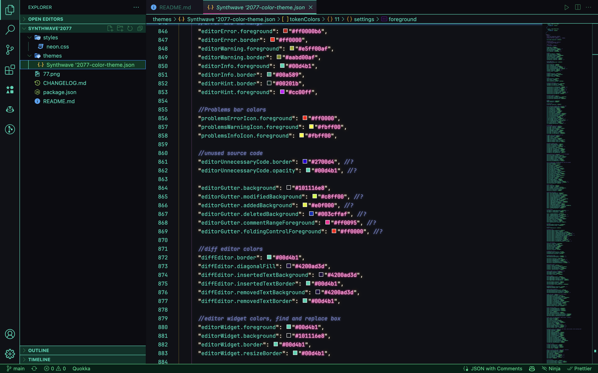
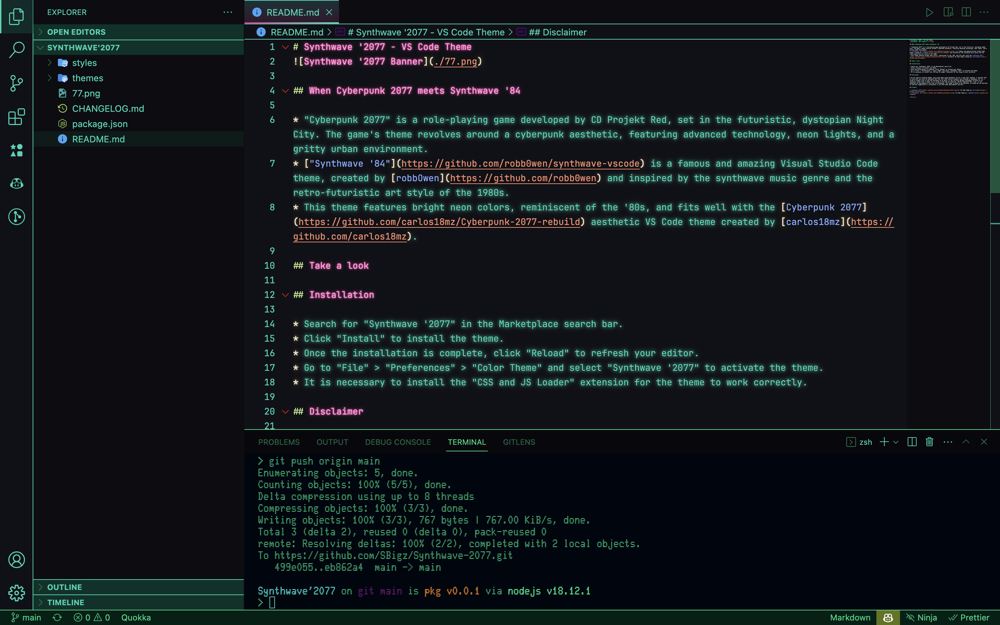

# Synthwave '2077 - VS Code Theme

## When Cyberpunk 2077 meets Synthwave '84 🦾

- "Cyberpunk 2077" is a role-playing game developed by CD Projekt Red, set in the futuristic, dystopian Night City. The game's theme revolves around a cyberpunk aesthetic, featuring advanced technology, neon lights, and a gritty urban environment.
- ["Synthwave '84"](https://github.com/robb0wen/synthwave-vscode) is a famous and amazing Visual Studio Code theme, created by [robbOwen](https://github.com/robb0wen) and inspired by the synthwave music genre and the retro-futuristic art style of the 1980s.
- This theme features bright neon colors, reminiscent of the '80s, and fits well with the [Cyberpunk 2077](https://github.com/carlos18mz/Cyberpunk-2077-rebuild) aesthetic VS Code theme created by [carlos18mz](https://github.com/carlos18mz).

## Take a look 🤖

## 

## 

## 

## 

## Installation 🔩

- Search for "Synthwave '2077" in the Marketplace search bar.
- Click "Install" to install the theme.
- Once the installation is complete, click "Reload" to refresh your editor.
- Go to "File" > "Preferences" > "Color Theme" and select "Synthwave '2077" to activate the theme.
- For the terminal, install [oh my zsh!](https://github.com/ohmyzsh/ohmyzsh) and pick the theme you want !

## Disclaimer 👀

I am not used to creating themes, and I have been using Synthwave '84 for a long time. However, I recently fell in love with the style of Cyberpunk 2077 but felt that certain elements were missing in Synthwave '84. So, I tried to create a mix of the two according to my taste. It was not easy because Synthwave '84 works as an extension rather than a theme, as it relies on CSS and JS injection, unlike Cyberpunk 2077. Thus, it can sometimes be challenging to mix the two techniques. The theme is bound to be improved, so please do not hesitate to send any suggestions or screenshots if you have made improvements yourself.

## Credits ✨

- [Cyberpunk 2077](https://github.com/carlos18mz/Cyberpunk-2077-rebuild) VS Code Theme by [carlos18mz](https://github.com/carlos18mz)
- ["Synthwave '84"](https://github.com/robb0wen/synthwave-vscode) VS Code Theme by [robbOwen](https://github.com/robb0wen)

## Enjoy !

Give a ⭐️ if you like the theme, fork it, and check out my other extension for VS Code, [CommentsAI](https://github.com/SBigz/CommentsAI) !
